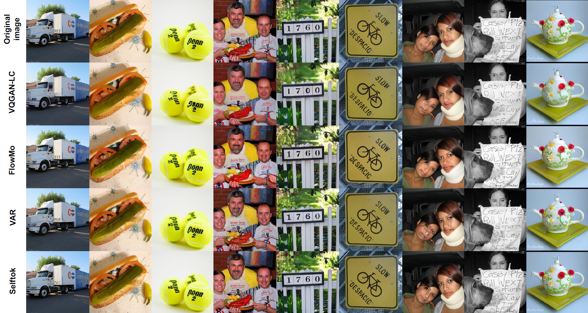
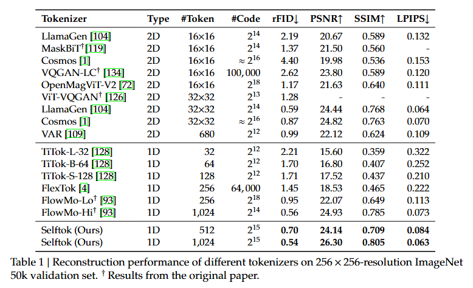

<div align="center">

<h2>⚡ Selftok: Discrete Visual Tokens of Autoregression, by Diffusion, and for Reasoning</h2>
<p><strong>Selftok Team, Media Technology Institute, Huawei</strong></p>

<p>
  <a href="LICENSE">
    
  </a>
  <a href="https://selftok-team.github.io/report/">
    
  </a>
  <a href="https://arxiv.org/abs/2505.07538">
    
  </a>
</p>

</div>


</div>
<div align="center">

</div>


## ✨ Highlights

- Propose Self-Consistency Tokenizer (Selftok), a **SOTA tokenizer** that achieves both high-quality reconstruction and high compression bit rate.

- Selftok offers an elegant and minimalist approach to unify diffusion and AR for vision-language models (VLM). 

- Our VLM achieves both SOTA visual comprehension and generation performances.


## 📰 News 

- **[2025.05.18]** The weights of tokenizer for Selftok are available on [HuggingFace](https://huggingface.co/selftok-team/SelftokTokenizer/tree/main).

- **[2025.05.15]** We have released the code of tokenizer for Selftok! The weights will be released soon.

- **[2025.05.12]** We have released the paper of Selftok ([arXiv](https://arxiv.org/abs/2505.07538))! 

- **[2025.04.04]** Our preliminary work **DDT-LLaMA** ([project page](https://ddt-llama.github.io/)) has been accepted as an **Oral Presentation** at CVPR 2025!


## 📄 Introduction

We completely discard the conventional spatial prior in image representation and introduce a novel discrete visual tokenizer: **Self-Consistency Tokenizer (Selftok)**. At its design core, we compose an autoregressive (AR) prior—mirroring the causal structure of language—into visual tokens by using the reverse diffusion process of image generation. The AR property makes Selftok fundamentally distinct from traditional spatial tokens in the following two key ways:

- *Selftok offers an elegant and minimalist approach to unify diffusion and AR for vision-language models*: By representing images with Selftok tokens, we can train vision-language models (VLMs) using a purely discrete autoregressive architecture—like that in LLMs—without requiring additional modules or training objectives.
- *We theoretically show that the AR prior satisfies the Bellman equation*, whereas the spatial prior does not. Therefore, Selftok supports reinforcement learning (RL) for visual generation with effectiveness comparable to that achieved in LLMs.

Besides the AR property, *Selftok is also a SOTA tokenizer that achieves both high-quality reconstruction and high compression bit rate*. After representing the training images as Selftok tokens, as a pure AR model, our VLM achieves both SOTA visual comprehension and generation performances. Impressively, without using any text-image training pairs, a simple policy gradient RL working in the visual tokens can significantly boost the visual generation benchmark, surpassing all the existing models by a large margin.

Therefore, we believe that Selftok effectively addresses the long-standing challenge that visual tokens cannot support effective RL. When combined with the well-established strengths of RL in LLMs, this brings us one step closer to realizing a truly multimodal LLM.


## 📝 Results

- **SoTA** Reconstruction Performance on ImageNet 256x256

<div align="center">

</div>


## 🎯 How to Use

---

### 🛠️ Installation

```bash
conda create -n selftok python=3.10  # or your preferred version
conda activate selftok

# For Ascend environment
pip install -r requirements.txt

# For GPU environment
pip install -r requirements_gpu.txt
```

---

### 🧠 Tokenizer Inference with Pre-trained Models

* **Download Pretrained Weights**

| Tokenizer                        | Image Resolution | # Tokens | PSNR  |
|:-------------------------------:|:----------:|:--------:|:-----:|
| Selftok w/o Renderer ([HuggingFace](https://huggingface.co/selftok-team/SelftokTokenizer/blob/main/tokenizer_512_ckpt.pth)) | 256×256   | 512      | 21.86 |
| Selftok w/ Renderer ([HuggingFace](https://huggingface.co/selftok-team/SelftokTokenizer/blob/main/renderer_512_ckpt.pth)) | 256×256   | 512      | 24.14 |
| Selftok w/o Renderer ([HuggingFace](https://huggingface.co/selftok-team/SelftokTokenizer/blob/main/tokenizer_1024_ckpt.pth))  | 256×256   | 1024     | 23.06 |
| Selftok w/ Renderer ([HuggingFace](https://huggingface.co/selftok-team/SelftokTokenizer/blob/main/renderer_1024_ckpt.pth))  | 256×256   | 1024     | 26.30 |

* **Pipeline Overview**

  The inference pipeline includes three key stages:

  1. **Tokenization** – Convert images into discrete token sequences.
  2. **Diffusion Decoding** – Reconstruct images using a 50-step diffusion model.
  3. **One-step Decoding** – Quickly reconstruct images using a fast renderer.


```
bash

git clone https://github.com/selftok-team/SelftokTokenizer.git
cd ./SelftokTokenizer
```


#### 1. Tokenization

This script demonstrates how to convert images into token sequences using a pretrained Selftok model.

```python
import argparse
from mimogpt.engine.utils import parse_args_from_yaml
from torchvision import transforms
from PIL import Image
import torch
import numpy as np
from mimogpt.infer.SelftokPipeline import SelftokPipeline
from mimogpt.infer.SelftokPipeline import NormalizeToTensor
from torchvision.utils import save_image

parser = argparse.ArgumentParser()
parser.add_argument("--yml-path", type=str, default="path/to/your/config.yml")
parser.add_argument("--pretrained", type=str, default="path/to/your/ckpt.pth")
parser.add_argument("--data_size", type=int, default=256)

cfg = parse_args_from_yaml(args.yml_path)
model = SelftokPipeline(cfg=cfg, ckpt_path=args.pretrained, datasize=args.data_size, device='cuda')

img_transform = transforms.Compose([
    transforms.Resize(args.data_size),
    transforms.CenterCrop(args.data_size),
    NormalizeToTensor(),
])

image_paths = ['path/to/image1.png', 'path/to/image2.png']
images = [img_transform(Image.open(p)) for p in image_paths]
images = torch.stack(images).to('cuda')

tokens = model.encoding(images, device='cuda')
np.save('token.npy', tokens.detach().cpu().numpy())
```

---

#### 2. Diffusion Decoding

Reconstruct images from token sequences using the full diffusion model (50 steps):

```python
import argparse
from mimogpt.engine.utils import parse_args_from_yaml
from torchvision import transforms
from PIL import Image
import torch
import numpy as np
from mimogpt.infer.SelftokPipeline import SelftokPipeline
from mimogpt.infer.SelftokPipeline import NormalizeToTensor
from torchvision.utils import save_image

parser = argparse.ArgumentParser()
parser.add_argument("--yml-path", type=str, default="path/to/your/config.yml")
parser.add_argument("--pretrained", type=str, default="path/to/your/ckpt.pth")
parser.add_argument("--data_size", type=int, default=256)

cfg = parse_args_from_yaml(args.yml_path)
model = SelftokPipeline(cfg=cfg, ckpt_path=args.pretrained, datasize=args.data_size, device='cuda')

tokens = np.load('token.npy')
images = model.decoding(tokens, device='cuda')

for b, img in enumerate(images):
    save_image(img, f"re_{b}.png")
```

---

#### 3. One-step Renderer Decoding

Reconstruct images using a fast, one-step renderer:

```python
import argparse
from mimogpt.engine.utils import parse_args_from_yaml
from torchvision import transforms
from PIL import Image
import torch
import numpy as np
from mimogpt.infer.SelftokPipeline import SelftokPipeline
from mimogpt.infer.SelftokPipeline import NormalizeToTensor
from torchvision.utils import save_image

parser = argparse.ArgumentParser()
parser.add_argument("--yml-path", type=str, default="path/to/your/config.yml")
parser.add_argument("--pretrained", type=str, default="path/to/your/ckpt.pth")
parser.add_argument("--data_size", type=int, default=256)

cfg = parse_args_from_yaml(args.yml_path)
model = SelftokPipeline(cfg=cfg, ckpt_path=args.pretrained, datasize=args.data_size, device='cuda')

tokens = np.load('token.npy')
images = model.decoding_with_renderer(tokens, device='cuda')

for b, img in enumerate(images):
    save_image(img, f"render_{b}.png")
```

---

## Notes

* Replace all `path/to/...` with actual paths on your system or object storage.
* The scripts assume CUDA is available; modify `device='cuda'` to `'cpu'` if running on CPU.
* The scripts support both Ascend and GPU. If inference with GPU, replace `mimogpt.infer.SelftokPipeline` with `mimogpt.infer.SelftokPipeline_GPU`.
* If you use Selftok Tokenizer for AR training, note that we decoder the image token sequence **reversely**!


## 🎮 Train Your Own Models

The training code is currently under preparation and will be released shortly. Please stay tuned for updates.


## 📝 Citation

If you find our work useful, please cite our related paper:

```

# Arxiv 
@article{wang2025discretevisualtokensautoregression,
      title={Discrete Visual Tokens of Autoregression, by Diffusion, and for Reasoning}, 
      author={Bohan Wang and Zhongqi Yue and Fengda Zhang and Shuo Chen and Li'an Bi and Junzhe Zhang and Xue Song and Kennard Yanting Chan and Jiachun Pan and Weijia Wu and Mingze Zhou and Wang Lin and Kaihang Pan and Saining Zhang and Liyu Jia and Wentao Hu and Wei Zhao and Hanwang Zhang},
      year={2025},
      eprint={2505.07538},
      archivePrefix={arXiv},
      primaryClass={cs.CV},
      url={https://arxiv.org/abs/2505.07538}, 
}

# CVPR 2025
@inproceedings{pan2025ddt,
  title={DDT-LLaMA: Generative Multimodal Pretraining with Discrete Diffusion Timestep Tokens},
  author={Kaihang Pan, Wang Lin, Zhongqi Yue, Tenglong Ao, Liyu Jia, Wei Zhao, Juncheng Li, Siliang Tang, Hanwang Zhang},
  booktitle={Proceedings of the IEEE/CVF Conference on Computer Vision and Pattern Recognition},
  year={2025}
}

```

## Disclaimer

This open-source project is **not an official Huawei product**. Huawei is **not responsible for providing support** or maintenance for this project.


